# Retail Sales Analysis Dashboard – Power BI Project

## Project Overview

This project is a complete end-to-end retail sales analysis and data cleaning workflow built in Microsoft Power BI. The project focuses on transforming raw retail order data into a clean, structured, and interactive business intelligence dashboard capable of delivering meaningful sales insights and performance analytics.

The workflow follows a real-world business intelligence process including:

- Data import and inspection
- Data cleaning and transformation
- Column standardization
- Data modeling
- DAX measure creation
- KPI analysis
- Interactive dashboard development
- Business insight generation

---

# Project Objectives

The primary goals of this project were:

- Clean and prepare messy retail sales data
- Remove inconsistencies and redundant columns
- Standardize categorical values
- Create meaningful calculated measures using DAX
- Build a relational data model
- Design an interactive dashboard for business stakeholders
- Generate actionable business insights

---

# Business Problem

Retail organizations often deal with:

- Dirty datasets
- Inconsistent product categories
- Missing or duplicated values
- Unstructured department information
- Poor reporting visibility
- Difficulty tracking profitability and sales performance

This project solves those issues by converting raw operational data into a professional analytics dashboard.

---

# Tools & Technologies Used

| Tool | Purpose |
|------|----------|
| Microsoft Power BI | Data visualization and dashboard development |
| Power Query | Data transformation and cleaning |
| DAX (Data Analysis Expressions) | KPI and measure calculations |
| Data Modeling | Relationship management |
| Excel / CSV Dataset | Source data |

---

# Dataset Description

The dataset contains retail transactional sales information including:

- Orders
- Products
- Categories
- Departments
- Discounts
- Profit
- Sales
- Customer locations
- Order status

The dataset required extensive cleaning before analysis could begin.

---

# Project Workflow

## 1. Data Import

The raw dataset was imported into Power BI using the Power Query Editor.

Initial inspection revealed several issues:

- Extra unnecessary columns
- Inconsistent category naming
- Untrimmed text values
- Invalid department formatting
- Incorrect country naming
- Dirty order status values
- Redundant discount columns

---

# 2. Data Cleaning Process

The dataset underwent multiple transformation stages.

---

## Removing Extra Columns

Unused and redundant columns were removed to improve model efficiency and dashboard performance.

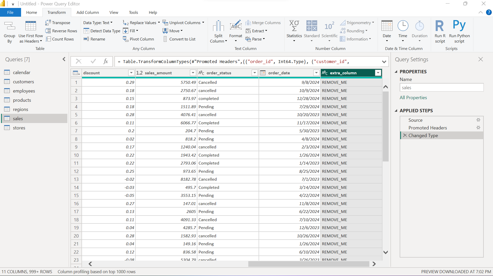

---

## Cleaning Department Column

The department column contained inconsistent and dirty values which were cleaned and standardized.

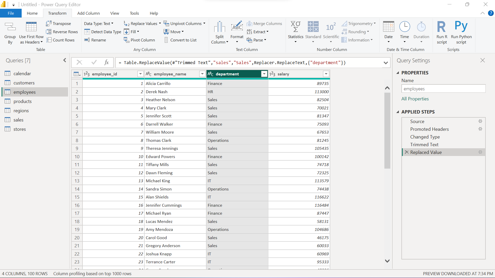

---

## Cleaning State Column

State values were standardized to maintain consistency across geographic reporting.


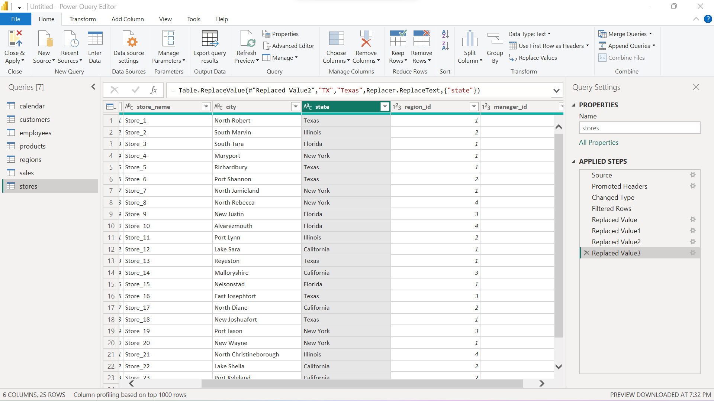

---

## Replacing Country Values with USA

Country naming inconsistencies were corrected by replacing variations with a standardized value.


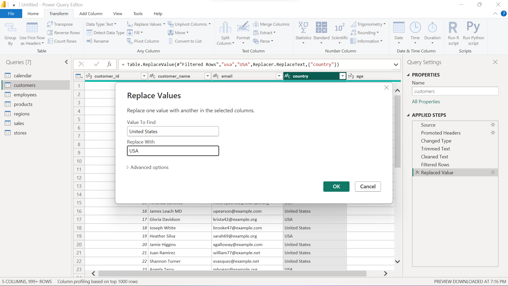

---

## Cleaning Product and Category Columns

Leading/trailing spaces and inconsistent formatting were removed using trim and clean operations.


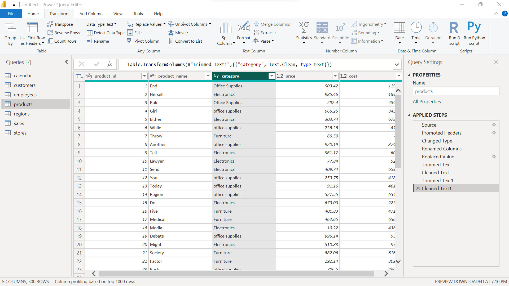

---

## Cleaning Order Status Column

Order statuses were standardized to improve reporting accuracy.


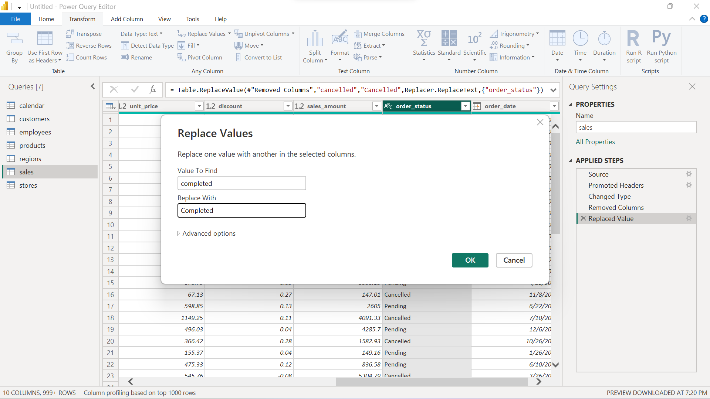

---

## Discount Column Transformation

Discount-related values were reviewed and transformed for accurate calculations.


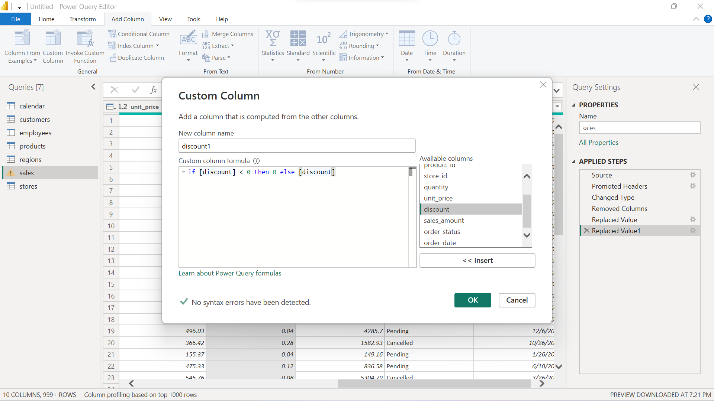

---

## Electronics Category Standardization

The electronics category data was cleaned and standardized to maintain consistency in category-level reporting and analysis.

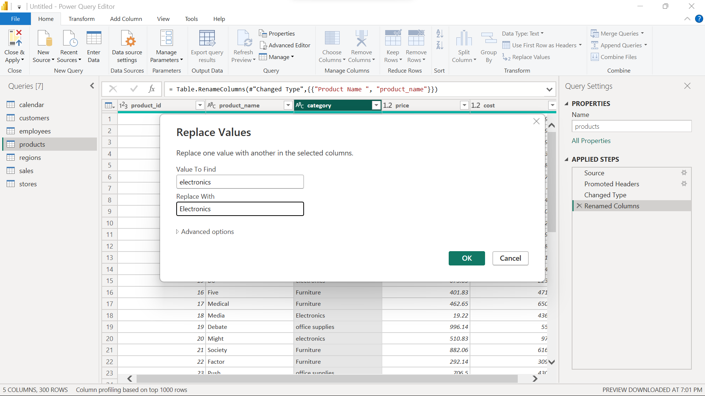

---

# 3. Data Modeling

A structured data model was created to establish relationships between tables and support efficient analytics.

The model enables:

- Faster querying
- Better filtering
- Accurate aggregations
- Scalable reporting


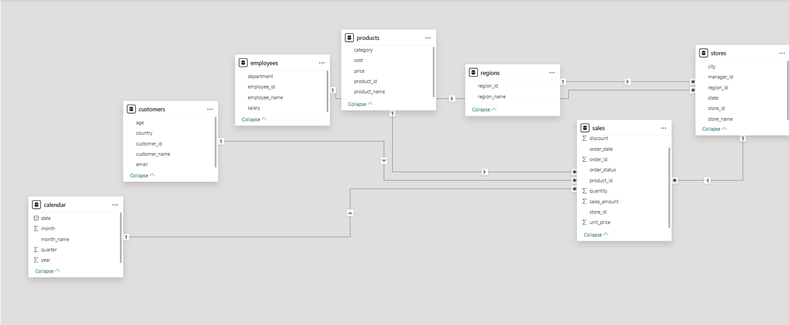

---

# 4. DAX Measures Creation

Several important DAX measures were created to generate KPIs and business insights.

---

## Total Sales Measure

This measure calculates overall revenue generated across all orders.

### DAX Formula

```DAX
Total Sales = SUM(Orders[Sales])
```


---

## Total Profit Measure

Calculates overall profit generated from all transactions.

### DAX Formula

```DAX
Total Profit = SUM(Orders[Profit])
```


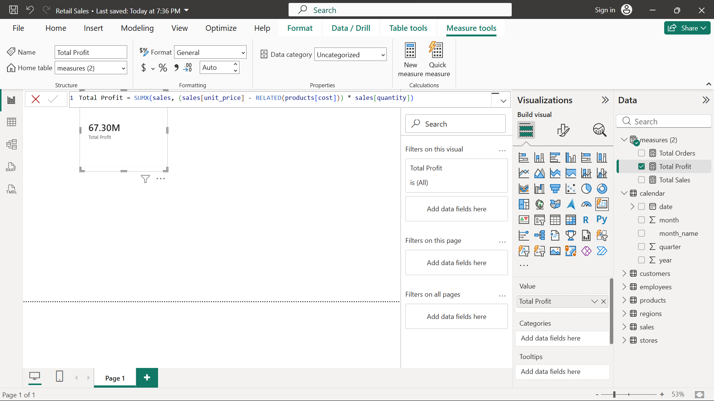

---

## Total Orders Measure

Tracks the total number of orders processed.

### DAX Formula

```DAX
Total Orders = COUNT(Orders[Order ID])
```

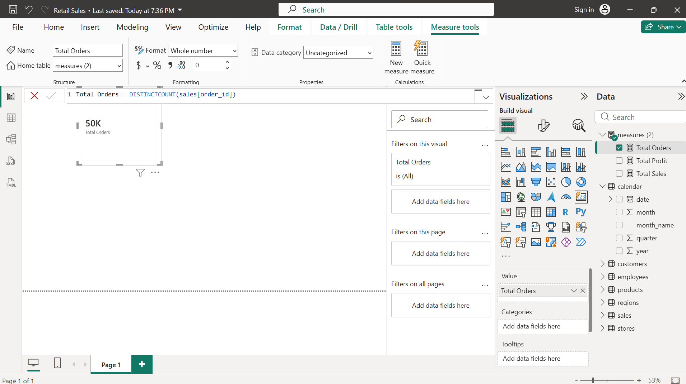

---

## Profit Margin Measure

Calculates business profitability percentage.

### DAX Formula

```DAX
Profit Margin = DIVIDE([Total Profit], [Total Sales], 0)
```

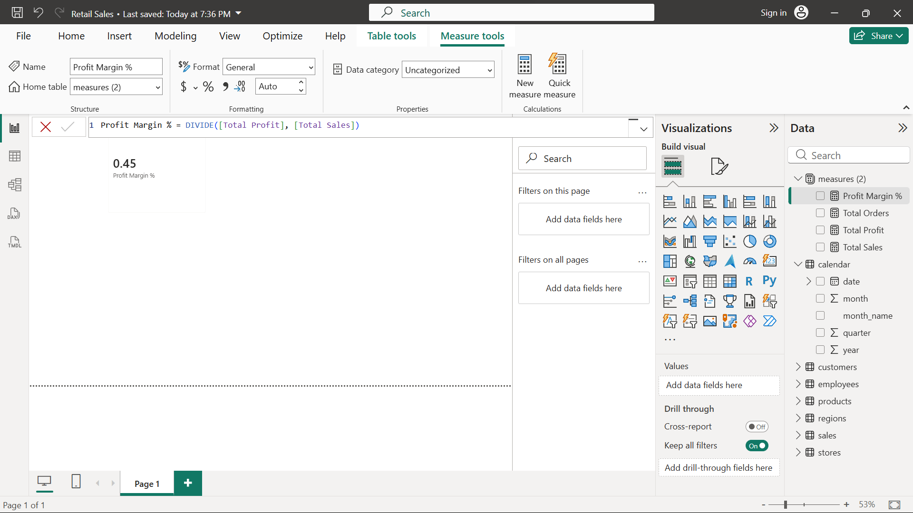

---

## Additional Measures

Additional KPIs and calculations were created to enhance reporting capabilities.


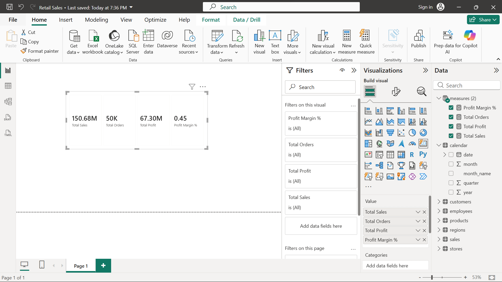

---

# Dashboard Features

The final dashboard includes:

- Interactive filtering
- KPI cards
- Sales trend analysis
- Profit analysis
- Order tracking
- Category performance
- Geographic insights
- Department analysis
- Business performance monitoring

The dashboard was designed with usability and executive reporting in mind.

---

# Key Business Insights

Using the dashboard, stakeholders can:

- Identify high-performing product categories
- Analyze sales trends over time
- Monitor profit margins
- Track order performance
- Detect underperforming departments
- Compare regional sales performance
- Evaluate discount impact on profitability

---

# Learning Outcomes

This project demonstrates practical knowledge in:

- Data cleaning in Power BI
- Power Query transformations
- DAX calculations
- Data modeling best practices
- Business intelligence reporting
- Dashboard design principles
- KPI development
- Analytical storytelling

---

# Project Structure

```bash
project-folder/
│
├── screenshots/
│   ├── category_electronics.png
│   ├── cleaned_department_col.png
│   ├── cleanup_state_col.png
│   ├── discount1_column.png
│   ├── extra_column_removed.png
│   ├── measures.png
│   ├── model_view.png
│   ├── order_status_column_cleaned.png
│   ├── product_and_category_trimandclean.png
│   ├── profit_margin_measure.png
│   ├── replace_with_USA.png
│   ├── total_orders_measure.png
│   ├── total_profit_measure.png
│   └── total_sales_measure.png
│
├── Retail_Sales_Analysis.pbix
├── dataset.csv
└── README.md
```

---

# Dashboard Development Process

The dashboard creation followed these stages:

1. Data Collection
2. Data Cleaning
3. Data Transformation
4. Data Modeling
5. DAX Measure Creation
6. KPI Design
7. Visualization Development
8. Dashboard Optimization
9. Insight Generation

This closely reflects real-world BI development workflows used by professional data analysts.

---

# Why This Project Matters

This project is valuable because it demonstrates:

- Real business problem solving
- End-to-end BI workflow execution
- Data transformation expertise
- Dashboard development skills
- Analytical thinking
- Practical Power BI implementation

It is suitable for:

- Data Analyst portfolios
- Business Intelligence portfolios
- Internship applications
- Entry-level analytics roles
- Power BI learning projects

---

# Future Improvements

Potential enhancements include:

- Advanced forecasting
- Time intelligence analysis
- Customer segmentation
- Inventory analysis
- Real-time data integration
- SQL database integration
- Advanced DAX optimization
- Predictive analytics

---

# Author

## Fred Kibutu

### Data Analyst | Data Engineer |Software Engineer

#### Skills

- Power BI
- SQL
- Python
- React
- Data Visualization
- Dashboard Development
- Business Intelligence
- Data Cleaning & Transformation

---

# Conclusion

This project demonstrates a complete business intelligence workflow using Power BI — from raw messy data to a professional interactive dashboard.

The project highlights essential real-world data analyst skills including:

- Data preparation
- Transformation
- KPI creation
- Data modeling
- Dashboard storytelling
- Insight generation

It serves as a strong portfolio project for showcasing practical analytics and business intelligence capabilities.
